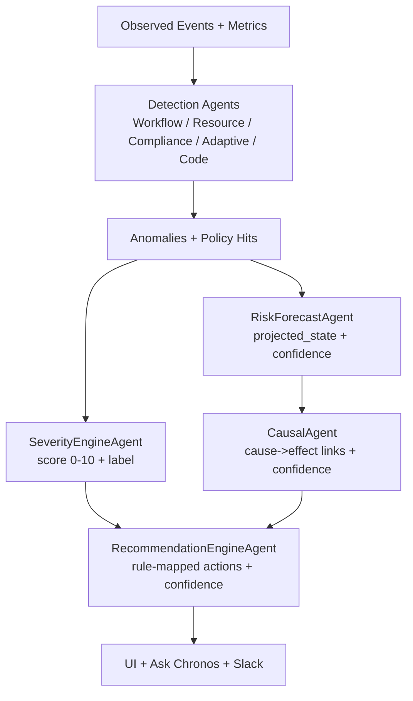

# Chronos Judge Guide: Risk Logic, Data Categorization, and Criticality Testing

Last updated: 2026-02-16

---

## 1) What Judges Should Verify

Chronos is designed so risk is **computed by deterministic system logic**, not by prompt text.  
LLMs may help with wording/query summaries, but:
- detection is rule/statistics-based
- severity/risk states are formula-based
- recommendations are rule-mapped

---

## 2) End-to-End Data Pipeline (Mermaid)

```mermaid
flowchart LR
  A["Sources<br/>GitHub, Datadog-style, Prometheus/Grafana-style,<br/>K8s audit, Webhooks, Client/Server events"] --> B["Ingestion APIs<br/>/ingest/envelope<br/>/ingest/github/webhook<br/>/observe/event<br/>/observe/metric"]
  B --> C["Observation Layer<br/>Append-only observed events/metrics"]
  C --> D["MasterAgent Cycle"]
  D --> E["Phase 1 (Parallel)<br/>WorkflowAgent<br/>ResourceAgent<br/>ComplianceAgent<br/>AdaptiveBaselineAgent<br/>CodeAgent"]
  E --> F["Phase 2 (Sequential)<br/>RiskForecastAgent -> CausalAgent"]
  F --> G["Phase 3<br/>SeverityEngineAgent<br/>RecommendationEngineAgent"]
  G --> H["Blackboard Cycle<br/>anomalies, policy_hits, risk_signals,<br/>causal_links, severity_scores, recommendations"]
  H --> I["Explanation + UI + Ask Chronos + Slack"]
```

---

## 3) Data Sources and How We Categorize Inputs

At ingest time, each event/metric is normalized with source metadata:
- `source_signature.tool_name` (for example `github`, `datadog`, `webhook`, `k8s_audit`)
- `tool_type` (metrics, logs, webhook, audit)
- entity context (workflow/resource/actor)

### Tool Examples

| Source Tool | Typical Payload | Normalized Category | Consumed By |
|---|---|---|---|
| GitHub webhook | PR merged, workflow run, CI results | `code_change`, `deployment`, `workflow_event` | `CodeAgent`, `WorkflowAgent` |
| Datadog-style stream | CPU/memory/latency alerts + logs | `resource_metric`, `runtime_event` | `ResourceAgent`, `CausalAgent` |
| Prometheus/Grafana-style | timeseries utilization/latency | `resource_metric` | `ResourceAgent`, `AdaptiveBaselineAgent` |
| K8s audit-like events | approval skip, privileged actions | `compliance_event` | `ComplianceAgent` |
| SIEM-like security events | unusual access/write behavior | `policy/security_event` | `ComplianceAgent`, `RiskForecastAgent` |
| Generic webhook/client/server | workflow/app events | `workflow_event`, `app_event` | `WorkflowAgent`, `CausalAgent` |

---

## 4) How We Determine Critical/High/Medium/Low

There are two separate but linked layers:

## 4.1 Detection-Level Criticality (Agent Rules)

### ResourceAgent fixed thresholds

| Metric | Warning | Critical | Sustained Window |
|---|---:|---:|---:|
| `cpu_percent` | 70 | 90 | 3 consecutive samples |
| `memory_percent` | 75 | 95 | 3 consecutive samples |
| `network_latency_ms` | 200 | 500 | 3 consecutive samples |

Important:
- one spike is not critical
- sustained breach is required (`SUSTAINED_RESOURCE_CRITICAL`)

### WorkflowAgent
- compares step duration vs SLA
- flags delay/missing/sequence violations

### ComplianceAgent
- checks policy rules (for example `NO_AFTER_HOURS_WRITE`, `NO_SKIP_APPROVAL`)
- generates `policy_hits` as hard violations

---

## 4.2 Severity Scoring Layer (0 to 10)

`SeverityEngineAgent` computes:
- base score from anomaly type + confidence
- context multipliers (asset, data, time, role, repetition, blast, module)
- weighted delta with clamp, then final `0..10` score

Label mapping:
- `None` (0)
- `Low` (0.1-3.9)
- `Medium` (4.0-6.9)
- `High` (7.0-8.9)
- `Critical` (9.0-10.0)

---

## 5) How Risk State Is Calculated (Exact Code Logic)

`RiskForecastAgent` maintains per-entity counters:
- `anomaly_count`
- `policy_violation_count`

Then it computes:

`total_issues = anomaly_count + (2 * policy_violation_count)`

State mapping:
- `total_issues == 0` -> `NORMAL`
- `total_issues <= 1` -> `DEGRADED`
- `total_issues <= 3` -> `AT_RISK`
- `total_issues <= 5` -> `VIOLATION`
- `else` -> `INCIDENT`

Risk-forecast confidence (exact):

`confidence = min(0.95, 0.5 + min(0.3, anomaly_count*0.1) + min(0.2, policy_violation_count*0.1))`

So policy hits increase both projected state (2x weight) and confidence.

---

## 6) Confidence Scoring: Exact Formulas by Module

All confidence is deterministic and evidence-based.  
No confidence score is generated from prompt tone.

### 6.1 Risk Forecast confidence

`confidence = min(0.95, 0.5 + min(0.3, anomaly_count*0.1) + min(0.2, policy_violation_count*0.1))`

Example:
- `anomaly_count=3`, `policy_violation_count=1`
- `confidence = min(0.95, 0.5 + 0.3 + 0.1) = 0.9`

### 6.2 Recommendation confidence

For anomaly-driven recommendations:

`conf = 0.5*base_rule_conf + 0.2*(severity_score/10) + 0.3*context_match_score`

Current implementation:
- `context_match_score = 1.0` when context factors exist, else `0.7`

For policy-driven recommendations:
- same formula, with context fixed at `1.0`.

### 6.3 Query/Ask Chronos confidence

`RAGQueryEngine` computes:

`avg = mean(clamp(evidence[i].confidence, 0, 1)) for top 10 evidence`

`bonus = min(0.08, 0.01 * max(0, evidence_count - 3))`

`query_confidence = min(1.0, avg + bonus)`

This rewards quality evidence first, then small volume bonus.

### 6.4 Severity confidence influence (via anomaly confidence)

`SeverityEngineAgent` base score includes anomaly confidence:
- `WORKFLOW_DELAY`: `base = 4 + 4*c`
- `SUSTAINED_RESOURCE_CRITICAL`: `base = 5 + 5*c`
- `MISSING_STEP`: `base = 7 + 2*c`
- etc. (`c` is anomaly confidence `0..1`)

Then context scales base:

`weighted_delta = clamp(sum(weight_i * (factor_i - 1)), -0.4, +0.6)`

`final_score = clamp(base * (1 + weighted_delta), 0, 10)`

### 6.5 Confidence Meaning (How to Explain to Judges)

- `90%+`: strong multi-signal agreement (sustained metrics + workflow/policy evidence)
- `70-89%`: good evidence, moderate uncertainty or less corroboration
- `<70%`: weak or sparse evidence, advisory only

Confidence is **evidence reliability**, not "probability LLM is correct."

---

## 7) Adaptation Logic (Dynamic Behavior)

`AdaptiveBaselineAgent` updates behavior continuously:
- rolling window: `WINDOW_SIZE`
- activation only after enough samples: `MIN_SAMPLES`
- adaptive threshold smoothing: `ADAPTATION_RATE`
- anomaly if deviation exceeds configured sigma threshold

Effect:
- fewer false positives from fixed static limits
- better sensitivity to context drift over time

---

## 7B) Risk Score Computation (System Index)

Chronos exposes a risk index style output and risk-state trajectory.

### 7B.1 Risk State (Forecast Layer)

Risk state is derived from issue volume and type:
- anomaly count
- policy violation count (weighted higher)

State progression:
`NORMAL -> DEGRADED -> AT_RISK -> VIOLATION -> INCIDENT`

### 7B.2 Composite Cycle Severity (Master Layer, 0-100)

Master cycle severity combines:
- anomaly contribution (weighted by anomaly type and confidence)
- policy contribution
- risk-signal contribution (higher weight for VIOLATION/INCIDENT)
- causal-chain bonus

Final value is clamped to `0..100`.

### 7B.2A Risk Index Tracker Formula (metrics/risk_index.py)

Per cycle, component scores are computed:

- `workflow_risk = 20 + sum(impact(type) * anomaly_confidence)` for workflow anomalies  
  impacts: `MISSING_STEP=25`, `WORKFLOW_DELAY=15`, `SEQUENCE_VIOLATION=20`
- `resource_risk = 20 + sum(impact(type) * anomaly_confidence)` for resource anomalies  
  impacts: `SUSTAINED_RESOURCE_CRITICAL=30`, `SUSTAINED_RESOURCE_WARNING=15`, `RESOURCE_DRIFT=10`
- `compliance_risk = 20 + 20 * policy_violation_count`

Then:

`risk_score = 0.35*workflow_risk + 0.35*resource_risk + 0.30*compliance_risk`

Each component is capped at `100`, and final risk score is persisted with contribution evidence.

### 7B.3 Scenario/Sandbox Risk Math (What-if)

Sandbox computes baseline vs simulated deltas:
- latency factor
- workload multiplier
- policy extension factor

These contribute to:
- `delta_sla`
- `delta_compliance`
- `delta_risk`

Then:
- `simulated_risk = min(100, baseline_risk + delta_risk)`
- projected state derived from simulated risk bands

### 7B.4 Risk Bands (Operational View)

- `0-29`: NORMAL
- `30-49`: DEGRADED
- `50-69`: AT_RISK
- `70-84`: VIOLATION
- `85-100`: INCIDENT

These bands are used for fast operator interpretation and escalation decisions.

---

## 8) What We Do to Logs After Fetching

### Processing steps
1. Ingest and normalize.
2. Store as observation facts.
3. Correlate by entity/time/workflow in cycle window.
4. Detect anomalies/policy hits.
5. Forecast risk and infer causal links.
6. Compute severity + recommendations.
7. Persist cycle artifacts for explainability/audit.

### Why this matters
- raw logs alone are noisy
- Chronos turns them into structured, actionable intelligence

---

## 9) Criticality Test Strategy (How We Validate It)

### Unit-level rule checks
- threshold crossing edge cases
- sustained window logic (2 vs 3 consecutive samples)
- policy trigger edge cases (time, actor, action)

### Scenario-level tests
- inject workload/latency/compliance scenarios
- run analysis cycles
- verify expected outputs:
  - anomaly type and count
  - risk state transition
  - severity label
  - recommendation presence

### Causality checks
- verify temporal ordering (`cause` before `effect`)
- confidence decreases as time gap increases

---

## 10) Risk + Severity + Recommendation Flow (Mermaid)

---

## 11) Black Friday Example (Judge Narrative)

Example chain:
- traffic surge + deploy pressure
- CPU/latency crosses sustained thresholds
- workflow step delays exceed SLA
- policy exposure grows under override pressure
- risk moves to `AT_RISK/VIOLATION`
- recommendations generated with confidence and evidence IDs

This demonstrates:
- proactive prediction
- explainable causality
- operationally useful action output

---

## 12) Key Judge Statement

Chronos does not say "critical" because an LLM prompt asked it to.  
Chronos says "critical" because coded thresholds, sustained windows, policy rules, causal timing, and deterministic scoring formulas converged on that state.
